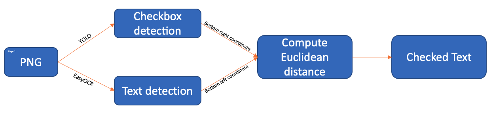

# Checkbox Detection and Text Extraction

## Introduction

- This tool helps you to extract the checked text (The text next to the checked box).
- It is built on top of [Checkbox-Detection](https://github.com/LynnHaDo/Checkbox-Detection) by [LynnHaDo](https://github.com/LynnHaDo).
- It uses the **Euclidean Distance** to extract the checked text following the result from checkbox detection model and the OCR

## Workflow

## Installation

    # Create virtual environment
    python3.11 -m venv .venv

    # Activate the virtual environment
    source .venv/bin/activate

    # Install the requirements from requirements.txt
    pip install -r requirements.txt

    # Install poppler-utils
    sudo apt-get install poppler-utils

## Demo

This is currently deployed in [HuggingFace Spaces](https://huggingface.co/spaces/oyashi163/checkbox_text_extraction)

## Note

Please use the sample image provided in `images` folder for testing purpose. 
You might want to modify the OCR parameters for your image to get more accurate later.

## References
- https://github.com/LynnHaDo/Checkbox-Detection
